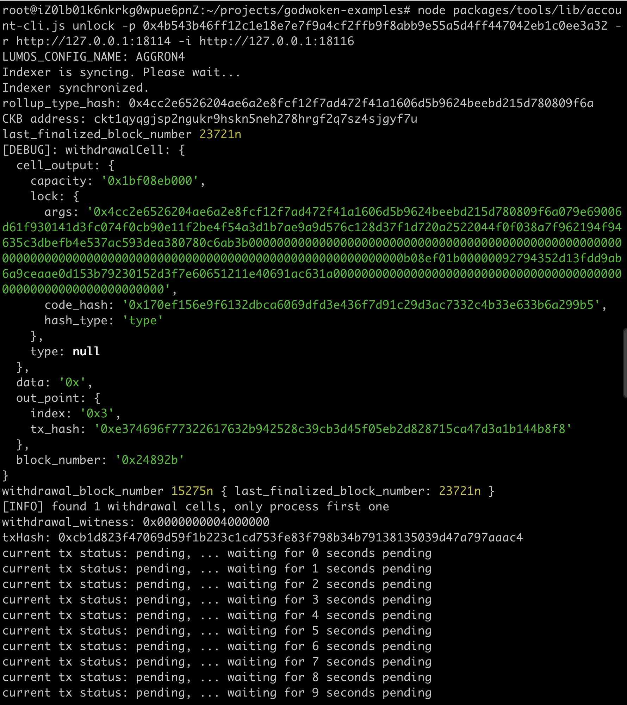
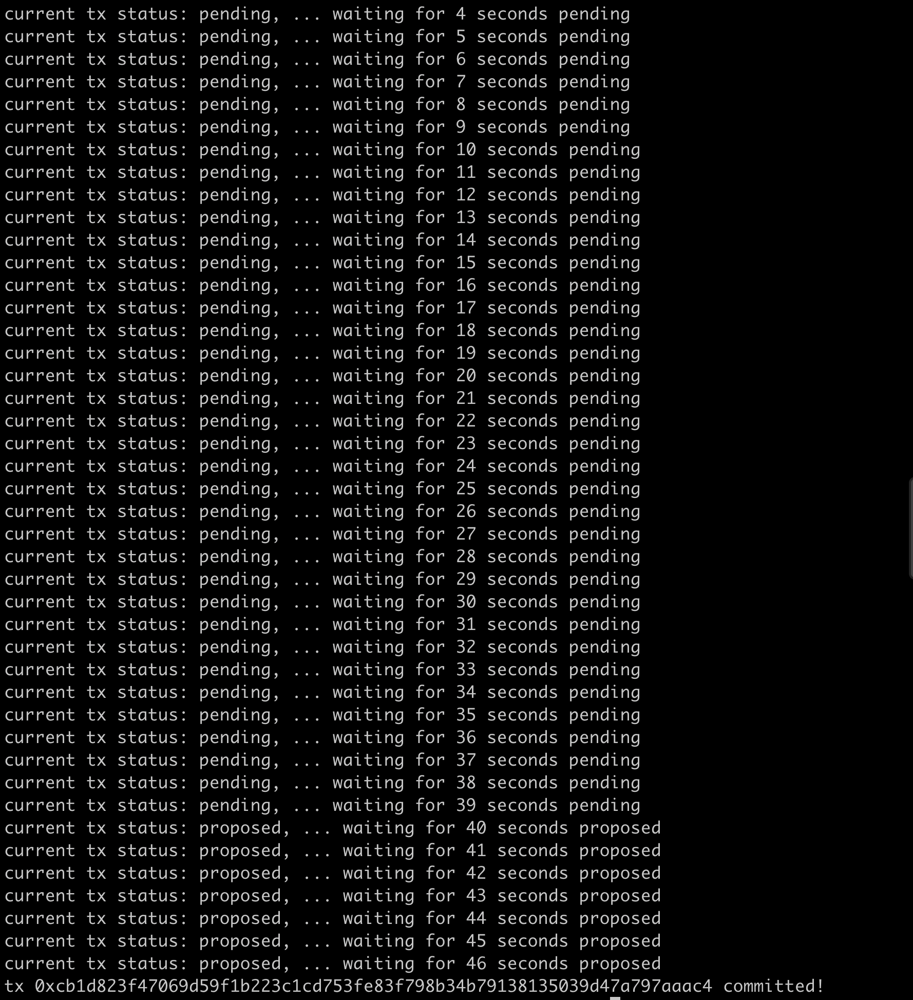

#### 1 A screenshot of the console output immediately after running the "unlock" command.

### 2 

0x22cD3376daa4057A7A3184cF14c18EDcc53683d6 

### 3 The Nervos Layer 1 address associated with the private key passed to "unlock" command (in text format). This is "ckb address" in the console output.

ckt1qyqgjsp2ngukr9hskn5neh278hrgf2q7sz4sjgyf7u