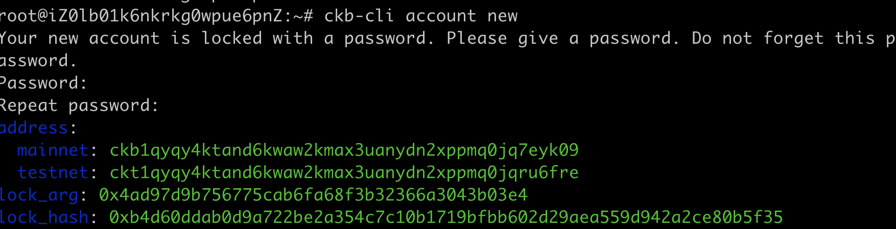
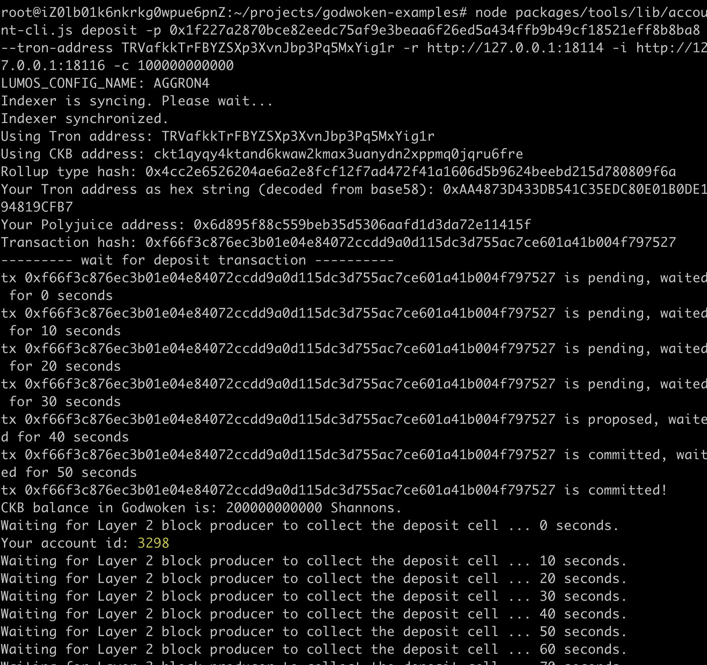
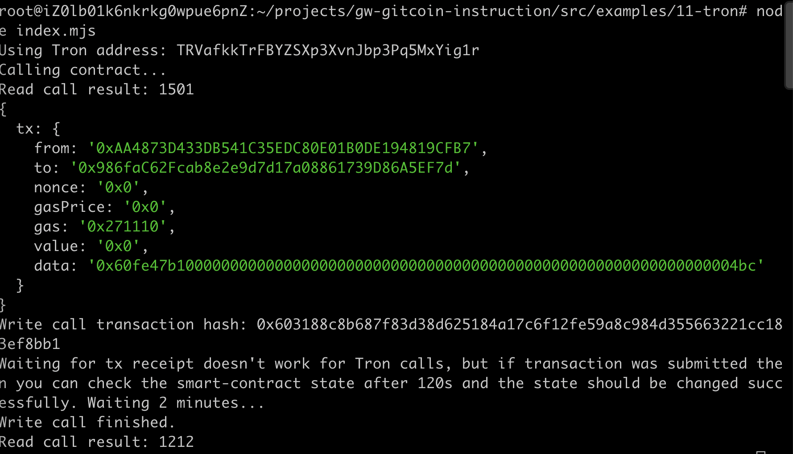

### 1 A screenshot of the accounts you created (account list) in ckb-cli.



### 2 A link to the Layer 1 address you funded on the Testnet Explorer.

https://explorer.nervos.org/aggron/transaction/0x513a31306458c022afca522232d78f126f7f1e1fe3d9160903247dbe981901ab

### 3 A screenshot of the console output immediately after you have successfully submitted a CKByte deposit to your Tron account on Layer 2.



### 4 A screenshot of the console output immediately after you have successfully issued a smart contract calls on Layer 2.



### 5 The transaction hash of the "Contract call" from the console output (in text format).

0x603188c8b687f83d38d625184a17c6f12fe59a8c984d355663221cc183ef8bb1

### 6 The contract address that you called (in text format).

0x986faC62Fcab8e2e9d7d17a08861739D86A5EF7d

### 7 The ABI for contract you made a call on (in text format).

```
[
    {
      "inputs": [],
      "stateMutability": "payable",
      "type": "constructor"
    },
    {
      "inputs": [
        {
          "internalType": "uint256",
          "name": "x",
          "type": "uint256"
        }
      ],
      "name": "set",
      "outputs": [],
      "stateMutability": "payable",
      "type": "function"
    },
    {
      "inputs": [],
      "name": "get",
      "outputs": [
        {
          "internalType": "uint256",
          "name": "",
          "type": "uint256"
        }
      ],
      "stateMutability": "view",
      "type": "function"
    }
]
```


### 8 Your Tron address (in text format).

TRVafkkTrFBYZSXp3XvnJbp3Pq5MxYig1r