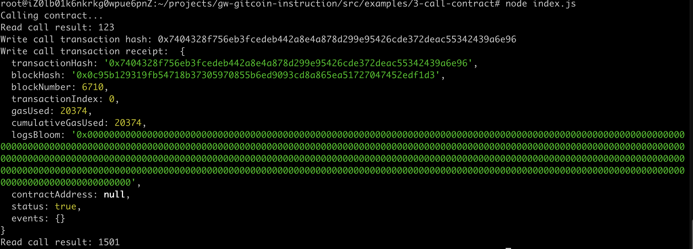

1



2

`transaction hash`：0x7404328f756eb3fcedeb442a8e4a878d299e95426cde372deac55342439a6e96

3

`contract address`: 0x986faC62Fcab8e2e9d7d17a08861739D86A5EF7d

4

`abi`:

```
[
    {
      "inputs": [],
      "stateMutability": "payable",
      "type": "constructor"
    },
    {
      "inputs": [
        {
          "internalType": "uint256",
          "name": "x",
          "type": "uint256"
        }
      ],
      "name": "set",
      "outputs": [],
      "stateMutability": "payable",
      "type": "function"
    },
    {
      "inputs": [],
      "name": "get",
      "outputs": [
        {
          "internalType": "uint256",
          "name": "",
          "type": "uint256"
        }
      ],
      "stateMutability": "view",
      "type": "function"
    }
]
```

