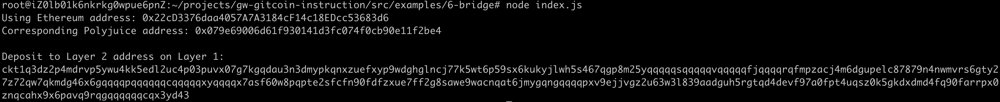

1

2

Receive address:  ckt1q3dz2p4mdrvp5ywu4kk5edl2uc4p03puvx07g7kgqdau3n3dmypkqnxzuefxyp9wdghglncj77k5wt6p59sx6kukyjlwh5s467qgp8m25yqqqqqsqqqqqvqqqqqfjqqqqrqfmpzacj4m6dgupelc87879n4nwmvrs6gty27z72qw7qkmdg46x6gqqqqpqqqqqqcqqqqqxyqqqqx7asf60w8pqpte2sfcfn90fdfzxue7ff2g8sawe9wacnqat6jmygqngqqqqpxv9ejjvgz2u63w3l839aadguh5rgtqd4devf97a0fpt4uqsz0k5gkdxdmd4fq90farrpx0znqcahx9x6pavq9rqgqqqqqqcqx3yd43

3

ETH address : 

0x22cD3376daa4057A7A3184cF14c18EDcc53683d6

4

Etherscan translation:

https://rinkeby.etherscan.io/tx/0x1a1a14aecc4f482a849442984bb74231742f5c7e6a84f190a7340f3ae6df96fe

5

Nervos transcation:

https://explorer.nervos.org/aggron/transaction/0xc8bb321c2cdcba7e175ac04fb7921eb6dde6d1d08af35c2e3ea1a52ae0eeb409