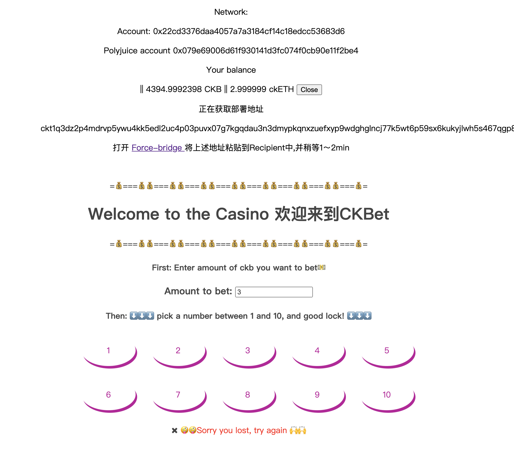

### 1 Screen of EVM Application on Layer2 with Force bridge

### 2  The address of the SUDT-ERC20 Proxy Contract that you deployed (in text format).

0x5704bf4a134181b4f3C74eaFB4150412F312F629

### 3 A link to the GitHub repository with your EVM application that integrates Force Bridge support.

https://github.com/timfaner/ckbet